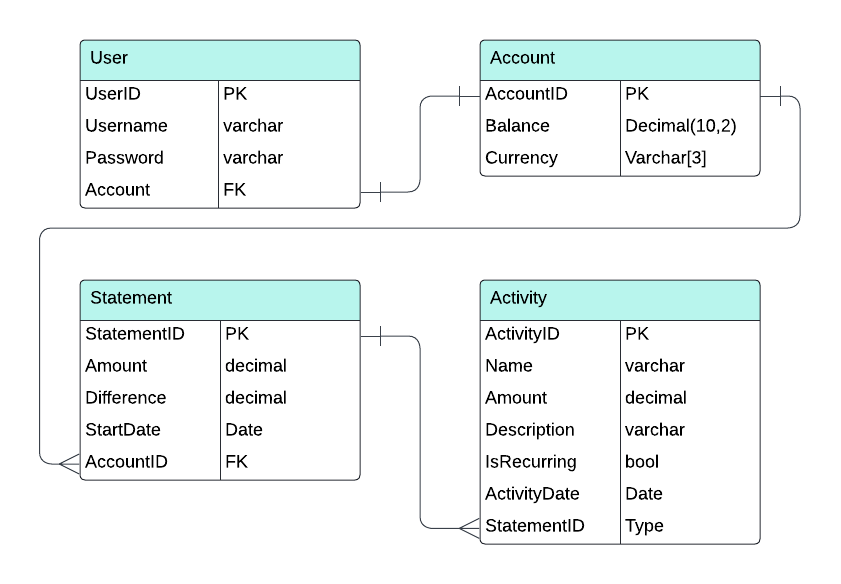

# Keji Banking App

## User Stories
- As a user, I want to be able to create an account so that I can interact with the app.
- As a user, I want to be able to log into my account so that I & only I can access my account.
- As a user, I want my account data & activity to persist to a database so that I can access it later.
- As a user, I want to be able to make deposits so that I can save my money.
- As a user, I want to be able to make withdrawals so that I can access my money.
- As a user, I want to be able to view a statement so that I can tell how much money I have & how my activity has happened.
- As a user, I want to be able to convert my account from one currency to another so that I can tell how much I will have when I travel.

## Stretch Goals
- As a user, I want to be able to create a financial goal to save a specified amount by a specified time so that I can track my financial success.

## External APIs
- Frankfurter Exchange Rates https://frankfurter.dev/

## ERD

## Project management system
- GitHub Projects

## Workflow
- Daily standups via Teams

## Team Members
- Kashyap Bathani
- Eldhose Salby
- Jean Valenzuela
- Isaac Hessel-Robinson